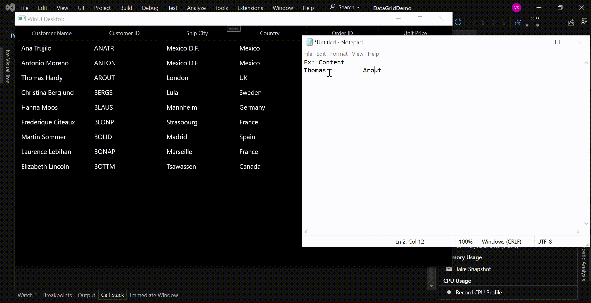

# How to paste the empty string while using cell selection in WinUI DataGrid

In [WinUI DataGrid](https://www.syncfusion.com/winui-controls/datagrid) (SfDataGrid), the default behavior does not allow an empty string to be pasted into a [GridCell](https://help.syncfusion.com/cr/winui/Syncfusion.UI.Xaml.DataGrid.GridCell.html) when the [SelectionUnit](https://help.syncfusion.com/cr/winui/Syncfusion.UI.Xaml.DataGrid.SfDataGrid.html#Syncfusion_UI_Xaml_DataGrid_SfDataGrid_SelectionUnit) is set to [Cell](https://help.syncfusion.com/cr/winui/Syncfusion.UI.Xaml.Grids.GridSelectionUnit.html#Syncfusion_UI_Xaml_Grids_GridSelectionUnit_Cell) or [Any](https://help.syncfusion.com/cr/winui/Syncfusion.UI.Xaml.Grids.GridSelectionUnit.html#Syncfusion_UI_Xaml_Grids_GridSelectionUnit_Any). However, this behavior can be modified by overriding the [PasteToRow](https://help.syncfusion.com/cr/winui/Syncfusion.UI.Xaml.DataGrid.DataGridClipboardController.html#Syncfusion_UI_Xaml_DataGrid_DataGridClipboardController_PasteToRow_System_Object_System_Object_) method in the [DataGridClipboardController](https://help.syncfusion.com/cr/winui/Syncfusion.UI.Xaml.DataGrid.DataGridClipboardController.html) class.
 
 ```C#
public class CustomCopyPaste : DataGridClipboardController
{
    private SfDataGrid dataGrid;
    public CustomCopyPaste(SfDataGrid sfgrid)
        : base(sfgrid)
    {
        dataGrid = sfgrid;
    }

    protected override void PasteToRow(object clipboardcontent, object selectedRecords)
    {
        if (dataGrid.SelectionUnit == GridSelectionUnit.Row)
            base.PasteToRow(clipboardcontent, selectedRecords);
        else
        {
            //Get the copied value.
            clipboardcontent = Regex.Split(clipboardcontent.ToString(), @"\t");
            var copyValue = (string[])clipboardcontent;

            int cellcount = copyValue.Count();
            var selectionContoller = this.dataGrid.SelectionController as GridCellSelectionController;
            var lastselectedindex = selectionContoller.CurrentCellManager.CurrentRowColumnIndex.ColumnIndex;
            //Get the PressedRowColumnIndex value using reflection.
            var Propertyinfo = (this.dataGrid.SelectionController as GridCellSelectionController).GetType().GetProperty("PressedRowColumnIndex", System.Reflection.BindingFlags.NonPublic | System.Reflection.BindingFlags.Instance);
            var pressedrowcolumnindex = Propertyinfo.GetValue(this.dataGrid.SelectionController);
            var pressedindex = ((RowColumnIndex)(pressedrowcolumnindex)).ColumnIndex;
            var pastecolumnindex = pressedindex < lastselectedindex ? pressedindex : lastselectedindex;

            int columnindex = 0;
            var columnstartindex = this.dataGrid.ResolveToGridVisibleColumnIndex(pastecolumnindex);
            for (int i = columnstartindex; i < cellcount + columnstartindex; i++)
            {
                if (dataGrid.PasteOption.HasFlag(GridPasteOptions.IncludeHiddenColumn))
                {
                    if (dataGrid.Columns.Count <= i)
                        break;
                    PasteToCell(selectedRecords, dataGrid.Columns[i], copyValue[columnindex]);
                    columnindex++;
                }
                else
                {
                    if (dataGrid.Columns.Count <= i)
                        break;
                    //Paste the copied value here include empty string value.
                    if (!dataGrid.Columns[i].IsHidden)
                    {
                        PasteToCell(selectedRecords, dataGrid.Columns[i], copyValue[columnindex]);
                        columnindex++;
                    }
                    else
                        cellcount++;
                }
            }
        }
    }
}

 ```



Take a moment to peruse the [WinUI DataGrid - Clipboard Operations](https://help.syncfusion.com/winui/datagrid/clipboard-operations) documentation, where you can find about the clipboard operations with code examples.